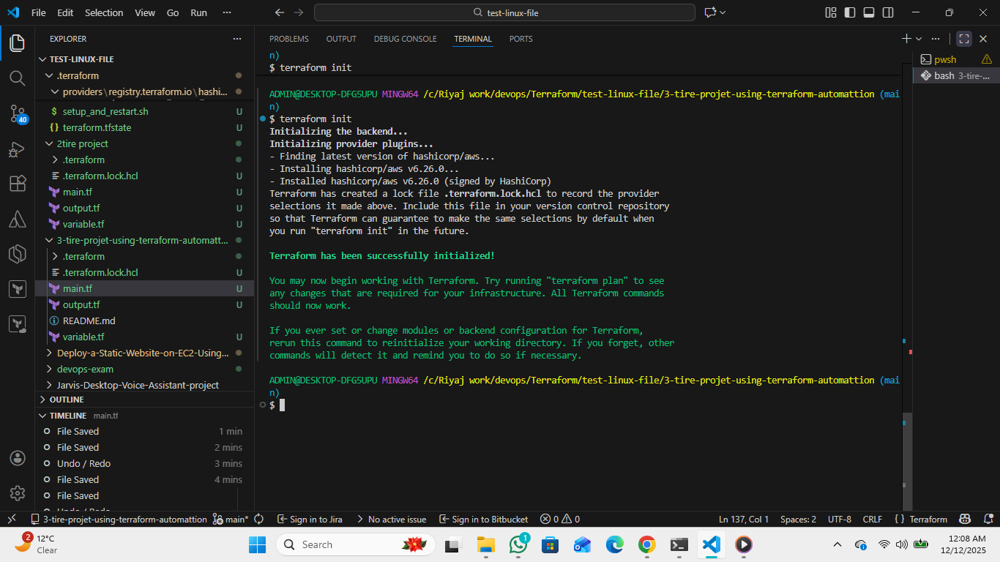
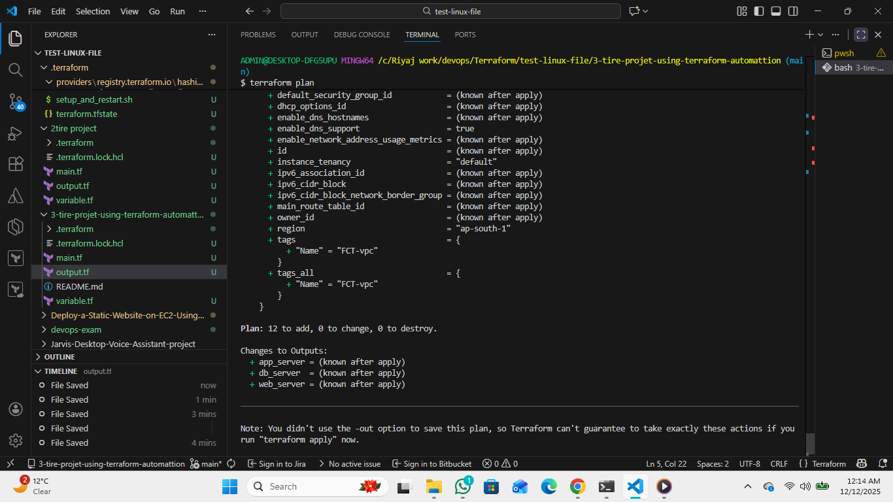
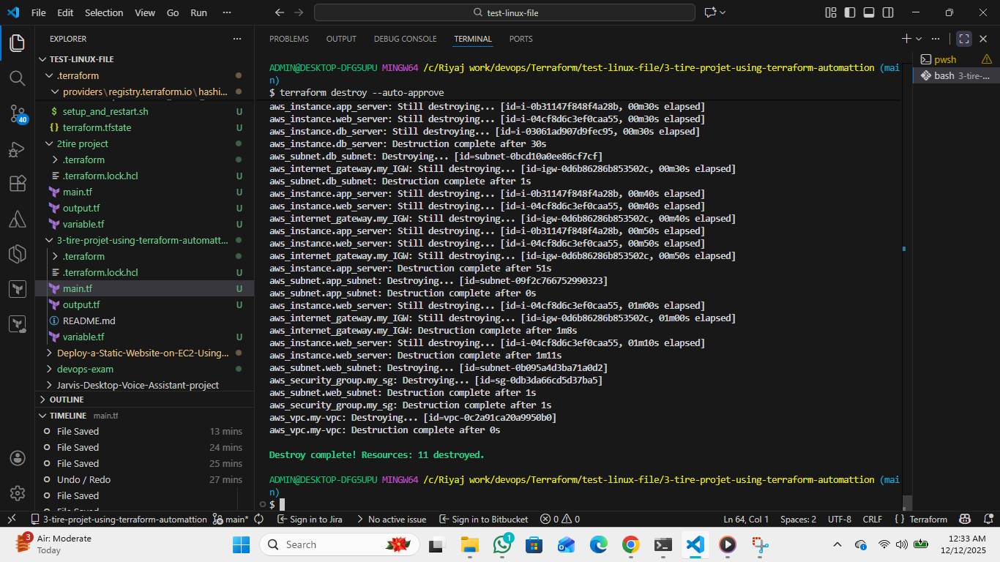
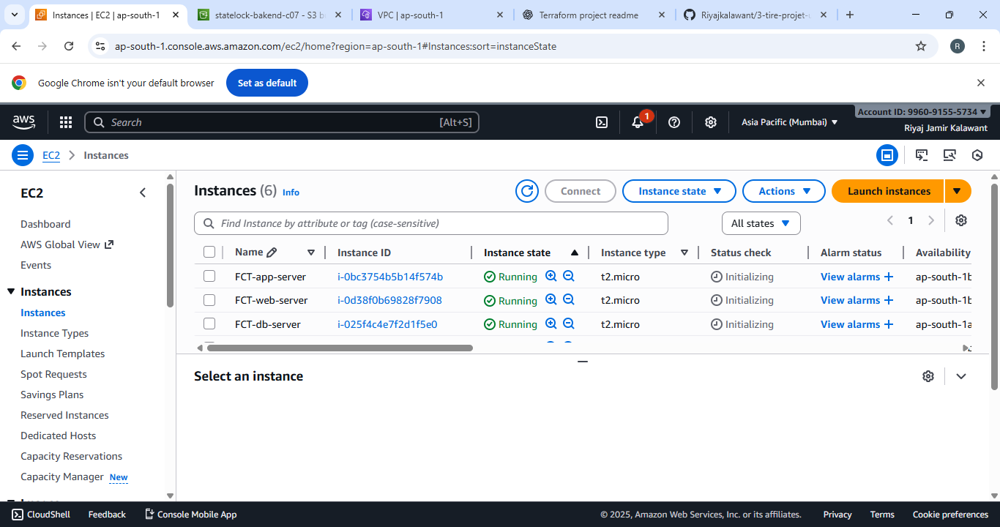
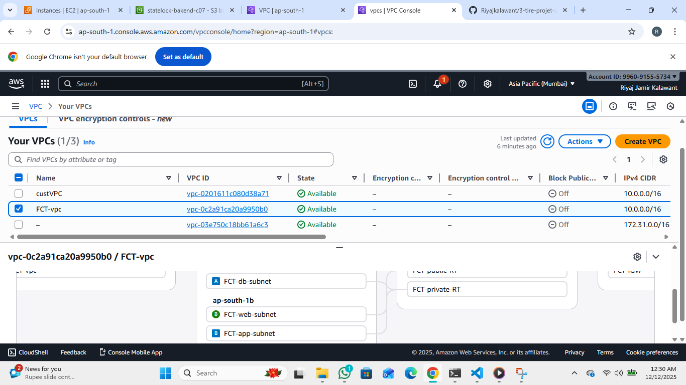
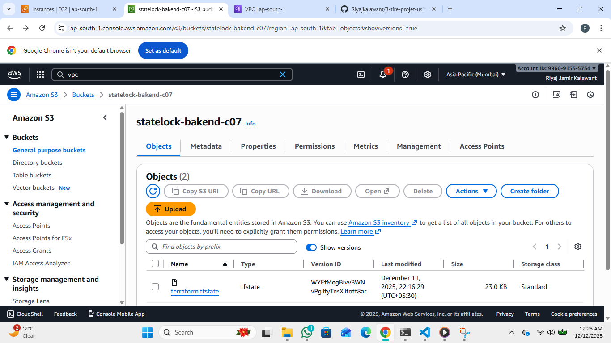

#  Terraform 3-Tier Infrastructure Project

This project demonstrates **end‑to‑end automation** of a full **3‑tier architecture** on AWS using **Terraform**.
It includes networking, compute, and storage components such as **VPC**, **Subnets**, **Route Tables**, **Internet Gateway**, **EC2 Instances**, and **S3 Bucket**.

---

##  Overview

Using Terraform, you can deploy a production‑ready 3‑tier setup:

* **Tier 1 – Network Layer:** VPC, Subnets, IGW, Route Tables
* **Tier 2 – Application Layer:** EC2 Instances + Security Groups
* **Tier 3 – Storage Layer:** S3 Bucket

All resources are fully automated using reusable Terraform modules.

---

##  Deploy Instructions

### 1️ Initialize Terraform

```bash
terraform init
```

Initializes provider plugins and working directory.

### 2️ Create an Execution Plan

```bash
terraform plan 
```

Shows all resources Terraform will create/modify.

### 3️ Apply the Configuration

```bash
terraform apply 
```

Creates full 3‑tier AWS infrastructure.

### 4️ Destroy the Infrastructure

```bash
terraform destroy -auto-approve
```

Removes all resources created by Terraform.

---

##  Resources Created

### **Network (Tier 1)**

* VPC
* Public Subnets
* Private Subnets
* Internet Gateway
* Route Tables & Associations

### **Compute (Tier 2)**

* EC2 instances (Web/App tier)
* Security Groups

### **Storage (Tier 3)**

* S3 Bucket

---

##  Screenshots

### **Terraform init**




### **Terraform plan**




### **Terraform apply**


### **Terraform destroy**





### **EC2 Instance**




### **VPC**





### **VPC Resource Map**


### **S3 Bucket Screenshot**





---

##  Best Practices

* Do NOT store AWS credentials in Git.
* Use S3 + DynamoDB Terraform backend in production.
* Keep modules reusable and clean.
* Restrict security group access (e.g., SSH allowed only from your IP).

---

##  Cleanup Command

Remove all resources safely:

```bash
terraform destroy -auto-approve
```

---

##  Conclusion

This project demonstrates how Terraform can be used to fully automate a complete 3‑tier AWS infrastructure. By leveraging modular code, reusable components, and best practices, you can deploy scalable, secure, and production-ready cloud environments with minimal manual effort. Terraform’s Infrastructure‑as‑Code approach ensures consistent deployments, easy maintenance, and quick teardown when required.

This setup is a strong foundation for real-world DevOps projects, CI/CD pipelines, and cloud automation workflows.

---


